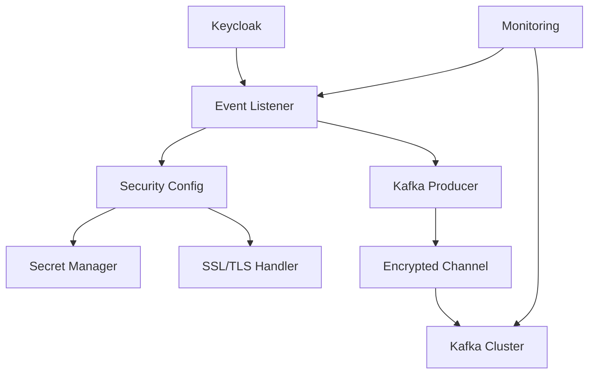

# Security Guide - Keycloak Kafka Event Listener

## Overview

This document outlines the security features, best practices, and configurations for the Keycloak Kafka Event Listener plugin. Security is a critical aspect of this plugin as it handles sensitive authentication and authorization events.

## Security Features

### 1. Encryption in Transit

#### Kafka SSL/TLS Configuration

The plugin supports full SSL/TLS encryption for Kafka communication:

```properties
# SSL/TLS Configuration
kafka.security.protocol=SSL
kafka.ssl.truststore.location=/path/to/kafka.client.truststore.jks
kafka.ssl.truststore.password=ENC(encrypted_password)
kafka.ssl.keystore.location=/path/to/kafka.client.keystore.jks
kafka.ssl.keystore.password=ENC(encrypted_password)
kafka.ssl.key.password=ENC(encrypted_password)
```

#### Supported Security Protocols

- `PLAINTEXT`: No encryption (development only)
- `SSL`: SSL/TLS encryption without authentication
- `SASL_PLAINTEXT`: SASL authentication without encryption
- `SASL_SSL`: SASL authentication with SSL/TLS encryption (recommended)

### 2. Authentication Methods

#### SASL Authentication

Multiple SASL mechanisms are supported:

##### SASL/PLAIN
```properties
kafka.security.protocol=SASL_SSL
kafka.sasl.mechanism=PLAIN
kafka.sasl.jaas.config=org.apache.kafka.common.security.plain.PlainLoginModule required username="user" password="ENC(encrypted_password)";
```

##### SASL/SCRAM-SHA-256
```properties
kafka.security.protocol=SASL_SSL
kafka.sasl.mechanism=SCRAM-SHA-256
kafka.sasl.jaas.config=org.apache.kafka.common.security.scram.ScramLoginModule required username="user" password="ENC(encrypted_password)";
```

##### SASL/SCRAM-SHA-512
```properties
kafka.security.protocol=SASL_SSL
kafka.sasl.mechanism=SCRAM-SHA-512
kafka.sasl.jaas.config=org.apache.kafka.common.security.scram.ScramLoginModule required username="user" password="ENC(encrypted_password)";
```

### 3. Secret Management

#### Encryption at Rest

Sensitive configuration values are encrypted using AES-256-GCM:

```bash
# Enable encryption
export KEYCLOAK_KAFKA_ENCRYPTION_ENABLED=true
export KEYCLOAK_KAFKA_MASTER_KEY=base64_encoded_key
```

#### Encrypted Value Format

Encrypted values are automatically detected and decrypted:
```
password=ENC(AQIDBAUGBwgJCgsMDQ4PEBESExQVFhcYGRobHB0eHw==)
```

#### Key Management Best Practices

1. **Master Key Storage**: Store the master key in a secure key management system
2. **Key Rotation**: Regularly rotate encryption keys
3. **Environment Separation**: Use different keys for different environments
4. **Backup**: Securely backup encryption keys

### 4. Network Security

#### Firewall Configuration

Restrict network access to required ports only:

```bash
# Kafka broker (SSL)
iptables -A INPUT -p tcp --dport 9093 -s keycloak_subnet -j ACCEPT

# Metrics endpoint (internal only)
iptables -A INPUT -p tcp --dport 9090 -s monitoring_subnet -j ACCEPT

# Block all other access
iptables -A INPUT -p tcp --dport 9093 -j DROP
iptables -A INPUT -p tcp --dport 9090 -j DROP
```

#### Network Segmentation

Implement network segmentation using VPCs or VLANs:

- **DMZ**: Reverse proxy/load balancer
- **Application Tier**: Keycloak servers
- **Data Tier**: Kafka cluster and databases
- **Management Network**: Monitoring and logging

#### TLS Certificate Management

Use proper certificate management:

```bash
# Generate CA certificate
openssl genrsa -out ca-key.pem 4096
openssl req -new -x509 -key ca-key.pem -out ca-cert.pem -days 365

# Generate server certificate
openssl genrsa -out kafka-key.pem 4096
openssl req -new -key kafka-key.pem -out kafka-cert.csr
openssl x509 -req -in kafka-cert.csr -CA ca-cert.pem -CAkey ca-key.pem -out kafka-cert.pem

# Create truststore and keystore
keytool -import -file ca-cert.pem -alias ca -keystore kafka.client.truststore.jks
keytool -import -file kafka-cert.pem -alias kafka -keystore kafka.client.keystore.jks
```

### 5. Access Control

#### Topic-Level Access Control

Configure Kafka ACLs for topic access:

```bash
# Allow Keycloak to produce to event topics
kafka-acls.sh --authorizer-properties zookeeper.connect=localhost:2181 \
  --add --allow-principal User:keycloak-user \
  --operation Write --topic keycloak.user.events

kafka-acls.sh --authorizer-properties zookeeper.connect=localhost:2181 \
  --add --allow-principal User:keycloak-user \
  --operation Write --topic keycloak.admin.events

# Allow monitoring to consume from all topics
kafka-acls.sh --authorizer-properties zookeeper.connect=localhost:2181 \
  --add --allow-principal User:monitoring-user \
  --operation Read --topic '*'
```

#### Keycloak Role-Based Access

Configure Keycloak realm roles for admin access:

```json
{
  "realm": "master",
  "roles": {
    "realm": [
      {
        "name": "kafka-admin",
        "description": "Kafka Event Listener Administration"
      }
    ]
  }
}
```

### 6. Data Privacy

#### Event Data Filtering

Configure which event types and fields to include:

```properties
# User events configuration
kafka.user.events.enabled=true
kafka.included.event.types=LOGIN,LOGOUT,REGISTER,UPDATE_PROFILE
kafka.excluded.fields=details.password,details.secret

# Admin events configuration
kafka.admin.events.enabled=true
kafka.included.admin.operations=CREATE,UPDATE,DELETE
kafka.exclude.representation=true
```

#### Data Masking

Sensitive data is automatically masked in logs:

```kotlin
// Password fields are automatically masked
"password": "***MASKED***"
"secret": "***MASKED***"
"token": "***MASKED***"
```

#### GDPR Compliance

For GDPR compliance:

1. **Data Minimization**: Only collect necessary event data
2. **Retention Policies**: Configure Kafka topic retention
3. **Right to be Forgotten**: Implement event deletion mechanisms
4. **Data Export**: Provide event data export functionality

### 7. Monitoring and Alerting

#### Security Monitoring

Monitor security-related metrics:

```yaml
# Security alerts in Prometheus
groups:
  - name: security
    rules:
      - alert: HighFailedAuthentications
        expr: rate(keycloak_kafka_events_sent_total{event_type="LOGIN_ERROR"}[5m]) > 10
        
      - alert: SuspiciousAdminActivity
        expr: rate(keycloak_kafka_events_sent_total{event_type="ADMIN_DELETE"}[5m]) > 5
        
      - alert: UnencryptedConnection
        expr: keycloak_kafka_connection_status{security_protocol="PLAINTEXT"} == 1
```

#### Audit Logging

All security events are logged:

```bash
# Security audit log format
2025-01-17 10:00:00 [SECURITY] [INFO] SSL connection established to kafka:9093
2025-01-17 10:01:00 [SECURITY] [WARN] Failed authentication attempt from 192.168.1.100
2025-01-17 10:02:00 [SECURITY] [ERROR] Invalid certificate presented by client
```

## Security Configuration Guide

### Production Security Checklist

- [ ] **Encryption**: Enable SSL/TLS for all Kafka communication
- [ ] **Authentication**: Configure SASL authentication
- [ ] **Authorization**: Set up Kafka ACLs
- [ ] **Secret Management**: Encrypt all sensitive configuration
- [ ] **Network Security**: Implement firewall rules and network segmentation
- [ ] **Certificate Management**: Use proper CA-signed certificates
- [ ] **Monitoring**: Set up security monitoring and alerting
- [ ] **Audit Logging**: Enable comprehensive audit logging
- [ ] **Data Privacy**: Configure event filtering and data masking
- [ ] **Regular Updates**: Keep all components updated

### Environment-Specific Configurations

#### Development Environment

```properties
# Minimal security for development
kafka.security.protocol=PLAINTEXT
kafka.encryption.enabled=false
kafka.audit.logging=false
```

#### Staging Environment

```properties
# Moderate security for staging
kafka.security.protocol=SASL_PLAINTEXT
kafka.sasl.mechanism=PLAIN
kafka.encryption.enabled=true
kafka.audit.logging=true
```

#### Production Environment

```properties
# Maximum security for production
kafka.security.protocol=SASL_SSL
kafka.sasl.mechanism=SCRAM-SHA-512
kafka.ssl.endpoint.identification.algorithm=https
kafka.encryption.enabled=true
kafka.audit.logging=true
kafka.security.monitoring=true
```

## Vulnerability Management

### Security Scanning

The project includes automated security scanning:

```bash
# Dependency vulnerability scanning
./gradlew dependencyCheckAnalyze

# Static code analysis
./gradlew detekt

# Container security scanning
docker run --rm -v $(pwd):/workspace aquasec/trivy:latest fs /workspace
```

### Dependency Updates

Regular dependency updates are managed through:

1. **Dependabot**: Automated dependency update PRs
2. **OWASP Dependency Check**: Vulnerability scanning
3. **Snyk**: Continuous vulnerability monitoring

### Security Disclosure

Report security vulnerabilities to: security@scriptonbasestar.com

Include:
- Description of the vulnerability
- Steps to reproduce
- Potential impact
- Suggested fix (if available)

## Compliance and Standards

### Standards Compliance

This plugin follows security standards:

- **OWASP Top 10**: Protection against common vulnerabilities
- **NIST Cybersecurity Framework**: Security controls implementation
- **ISO 27001**: Information security management
- **SOC 2**: Security, availability, and confidentiality controls

### Certification Support

The plugin supports compliance requirements for:

- **PCI DSS**: Payment card industry security
- **HIPAA**: Healthcare information protection
- **SOX**: Financial reporting controls
- **GDPR**: Data protection regulations

## Security Architecture

### Defense in Depth

Multiple security layers:

1. **Network Layer**: Firewalls, VPNs, network segmentation
2. **Transport Layer**: TLS encryption, certificate validation
3. **Authentication Layer**: SASL mechanisms, mutual TLS
4. **Authorization Layer**: Kafka ACLs, Keycloak roles
5. **Application Layer**: Input validation, secret management
6. **Data Layer**: Encryption at rest, data masking
7. **Monitoring Layer**: Security event monitoring, alerting

### Security Components



---

*This security guide is regularly updated. Last revision: 2025-01-17*