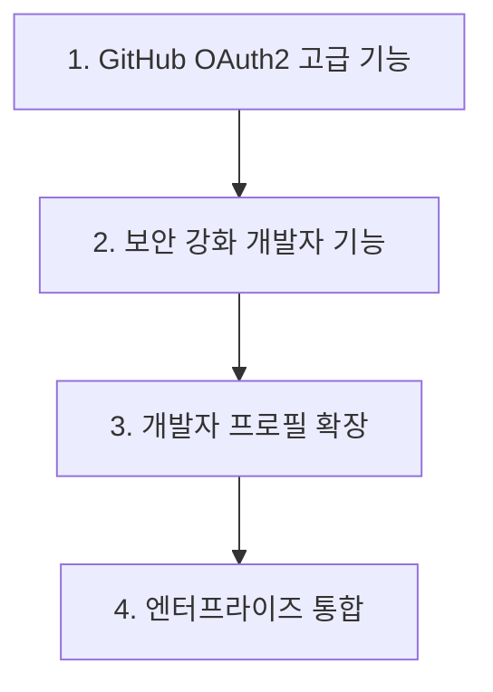

# GitHub OAuth2 Provider 고도화 및 기능 확장

## 📋 작업 개요

기존 GitHub Identity Provider를 현대적인 OAuth2 표준에 맞춰 고도화하고, 개발자 친화적인 기능과 엔터프라이즈급 보안 기능을 추가합니다.

## 🎯 작업 목록

### 1. GitHub OAuth2 고급 기능 구현
**우선순위**: High  
**예상 시간**: 25분

- [ ] GitHub OAuth2 최신 API 및 스코프 지원 (user, user:email, read:org, read:user)
- [ ] GitHub Enterprise Server 지원
- [ ] GitHub Apps 통합 지원 
- [ ] 조직 멤버십 검증 기능
- [ ] 팀 기반 접근 제어

**검증 기준**:
- 모든 GitHub OAuth2 스코프가 정상 동작
- GitHub Enterprise Server 연동 성공
- 조직 멤버십 검증 통과
- 팀 기반 권한 매핑 성공

### 2. 보안 강화 및 개발자 기능
**우선순위**: High  
**예상 시간**: 20분

- [ ] PKCE (Proof Key for Code Exchange) 지원
- [ ] State 파라미터 강화 (CSRF 방지)
- [ ] GitHub SSH Key 검증 기능
- [ ] 2FA/MFA 상태 확인
- [ ] Rate limiting 및 API 제한 준수

**검증 기준**:
- PKCE 플로우가 정상 동작
- SSH Key 검증이 성공
- 2FA 상태가 정확히 감지
- Rate limiting이 적절히 작동

### 3. 개발자 프로필 확장 및 속성 매핑
**우선순위**: Medium  
**예상 시간**: 20분

- [ ] GitHub Profile API 완전 활용
- [ ] 개발자 통계 정보 수집 (repos, followers, contributions)
- [ ] 조직 및 팀 멤버십 자동 매핑
- [ ] GitHub 계정 활동 상태 확인
- [ ] 프로그래밍 언어 및 기술 스택 추출

**검증 기준**:
- 모든 개발자 속성이 정확히 매핑
- 조직/팀 정보가 Keycloak에 반영
- 활동 상태가 올바르게 표시
- 기술 스택 정보가 추출됨

### 4. 엔터프라이즈 통합 기능
**우선순위**: Medium  
**예상 시간**: 15분

- [ ] GitHub Enterprise 조직 구조 동기화
- [ ] GitHub Teams를 Keycloak Groups로 자동 매핑
- [ ] Repository 접근 권한 기반 인가
- [ ] GitHub Audit Log 연동
- [ ] SAML SSO 통합 지원

**검증 기준**:
- Enterprise 조직 구조가 정확히 매핑
- Teams가 Keycloak Groups로 동기화
- Repository 권한이 정확히 반영
- Audit Log가 정상 수집

## 🔧 기술 세부사항

### GitHub OAuth2 최신 엔드포인트
```kotlin
object GitHubOAuth2Endpoints {
    const val AUTHORIZATION_URL = "https://github.com/login/oauth/authorize"
    const val TOKEN_URL = "https://github.com/login/oauth/access_token"
    const val USER_API_URL = "https://api.github.com/user"
    const val USER_EMAILS_URL = "https://api.github.com/user/emails"
    const val USER_ORGS_URL = "https://api.github.com/user/orgs"
    const val USER_TEAMS_URL = "https://api.github.com/user/teams"
}
```

### PKCE 구현
```kotlin
class GitHubPKCEHandler {
    fun generateCodeChallenge(): PKCEParams
    fun verifyCodeChallenge(codeVerifier: String, codeChallenge: String): Boolean
    fun buildAuthorizationUrl(config: GitHubConfig, pkce: PKCEParams): String
}
```

### 개발자 속성 매핑
```kotlin
class GitHubDeveloperAttributeMapper : GitHubUserAttributeMapper() {
    fun mapDeveloperProfile(userInfo: JsonNode, user: BrokeredIdentityContext)
    fun mapOrganizationMembership(userInfo: JsonNode, user: BrokeredIdentityContext)
    fun mapRepositoryPermissions(userInfo: JsonNode, user: BrokeredIdentityContext)
}
```

## 📈 예상 효과

### 개발자 경험 개선
- **완전한 GitHub 통합**: 개발자 워크플로우와 자연스러운 연동
- **조직/팀 기반 권한**: GitHub 조직 구조를 그대로 Keycloak에 반영
- **Repository 기반 인가**: 프로젝트별 세밀한 접근 제어

### 보안 향상
- **PKCE 지원**: OAuth2 보안 최신 표준 준수
- **2FA 검증**: GitHub 2FA 상태 확인으로 보안 강화
- **SSH Key 검증**: 개발자 신원 이중 확인

### 엔터프라이즈 기능
- **조직 동기화**: GitHub Enterprise 조직도 자동 반영
- **팀 관리**: GitHub Teams를 Keycloak 역할로 자동 매핑
- **감사 로그**: 개발자 활동 추적 및 컴플라이언스

## 🔄 의존성 관계



## ✅ 완료 기준

### 기능적 요구사항
- [ ] 모든 GitHub OAuth2 고급 기능 동작
- [ ] PKCE 및 보안 강화 완료
- [ ] 확장 개발자 속성 매핑 정상 동작
- [ ] 엔터프라이즈 기능 통합 완료

### 비기능적 요구사항
- [ ] 기존 GitHub IDP 호환성 유지
- [ ] GitHub API Rate Limit 준수
- [ ] 설정 복잡도 합리적 수준
- [ ] 문서화 완료

## 🚀 다음 단계

이 작업 완료 후 다음 우선순위:
1. **Microsoft Azure AD Provider 신규 구현**
2. **Apple Sign-In Provider 추가**
3. **Discord OAuth2 Provider 구현**
4. **SAML 2.0 Provider 추가**

---

**소요 시간**: 약 1시간 20분  
**난이도**: Medium-High  
**영향도**: High (개발자 사용자 경험 대폭 개선)