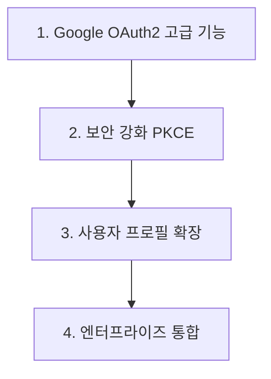

# Google OAuth2 Provider 고도화 및 기능 확장

## 📋 작업 개요

기존 Google Identity Provider를 확장하여 최신 Google OAuth2 기능과 보안 표준을 지원하고, 엔터프라이즈 환경에 최적화된 기능을 추가합니다.

## 🎯 작업 목록

### 1. Google OAuth2 고급 기능 구현
**우선순위**: High  
**예상 시간**: 30분

- [ ] Google OAuth2 최신 스코프 지원 (openid, email, profile, plus.me)
- [ ] Google Workspace 도메인 제한 기능
- [ ] Google Apps Script API 연동 지원
- [ ] HD (Hosted Domain) 파라미터 검증
- [ ] Google 2단계 인증 상태 확인

**검증 기준**:
- 모든 Google OAuth2 스코프가 정상 동작
- Workspace 도메인 제한이 올바르게 작동
- HD 파라미터 검증 통과
- 2FA 상태 정확히 감지

### 2. 보안 강화 및 PKCE 지원
**우선순위**: High  
**예상 시간**: 25분

- [ ] PKCE (Proof Key for Code Exchange) 완전 지원
- [ ] State 파라미터 강화 (CSRF 방지)
- [ ] ID Token 검증 강화 (signature, audience, issuer)
- [ ] Google Certificate 자동 갱신 지원
- [ ] Rate limiting 및 브루트포스 방지

**검증 기준**:
- PKCE 플로우가 정상 동작
- ID Token 검증이 모든 케이스에서 통과
- State 파라미터 보안이 강화됨
- Certificate 검증이 자동화됨

### 3. 사용자 프로필 확장 및 속성 매핑
**우선순위**: Medium  
**예상 시간**: 20분

- [ ] Google+ API 대신 People API 사용
- [ ] 확장된 사용자 속성 지원 (조직, 부서, 직책)
- [ ] Google Photos 프로필 이미지 고해상도 지원
- [ ] 언어 및 지역 설정 자동 매핑
- [ ] Google Calendar 및 Drive 권한 연동

**검증 기준**:
- People API에서 모든 속성이 정확히 매핑
- 고해상도 프로필 이미지 로드
- 언어/지역 설정이 Keycloak에 반영
- 확장 권한이 올바르게 요청됨

### 4. 엔터프라이즈 통합 기능
**우선순위**: Medium  
**예상 시간**: 15분

- [ ] Google Admin SDK 연동 (조직 구조 동기화)
- [ ] Google Groups 멤버십 자동 매핑
- [ ] Google Workspace SSO 통합
- [ ] 사용자 계정 상태 실시간 동기화
- [ ] Google Audit Log 연동

**검증 기준**:
- 조직 구조가 Keycloak 그룹에 정확히 매핑
- Groups 멤버십이 자동 동기화
- 계정 상태 변경이 실시간 반영
- Audit Log가 정상 수집

## 🔧 기술 세부사항

### Google OAuth2 최신 엔드포인트
```kotlin
object GoogleOAuth2Endpoints {
    const val AUTHORIZATION_URL = "https://accounts.google.com/o/oauth2/v2/auth"
    const val TOKEN_URL = "https://oauth2.googleapis.com/token"
    const val USERINFO_URL = "https://www.googleapis.com/oauth2/v3/userinfo"
    const val PEOPLE_API_URL = "https://people.googleapis.com/v1/people/me"
    const val JWKS_URL = "https://www.googleapis.com/oauth2/v3/certs"
}
```

### PKCE 구현
```kotlin
class GooglePKCEHandler {
    fun generateCodeChallenge(): PKCEParams
    fun verifyCodeChallenge(codeVerifier: String, codeChallenge: String): Boolean
    fun buildAuthorizationUrl(config: GoogleConfig, pkce: PKCEParams): String
}
```

### 확장 속성 매핑
```kotlin
class GoogleAdvancedAttributeMapper : GoogleUserAttributeMapper() {
    fun mapWorkspaceAttributes(userInfo: JsonNode, user: BrokeredIdentityContext)
    fun mapOrganizationStructure(userInfo: JsonNode, user: BrokeredIdentityContext)
    fun mapGroupMemberships(userInfo: JsonNode, user: BrokeredIdentityContext)
}
```

## 📈 예상 효과

### 보안 향상
- **PKCE 지원**: OAuth2 보안 최신 표준 준수
- **ID Token 검증**: JWT 위변조 방지
- **도메인 제한**: 인가되지 않은 도메인 접근 차단

### 사용자 경험 개선
- **자동 프로필 동기화**: 최신 사용자 정보 자동 반영
- **고해상도 이미지**: 선명한 프로필 사진
- **언어 설정**: 자동 현지화

### 엔터프라이즈 기능
- **조직 동기화**: Google Workspace 조직도 자동 반영
- **그룹 관리**: Google Groups를 Keycloak 역할로 자동 매핑
- **실시간 동기화**: 계정 상태 변경 즉시 반영

## 🔄 의존성 관계



## ✅ 완료 기준

### 기능적 요구사항
- [ ] 모든 Google OAuth2 고급 기능 동작
- [ ] PKCE 및 보안 강화 완료
- [ ] 확장 속성 매핑 정상 동작
- [ ] 엔터프라이즈 기능 통합 완료

### 비기능적 요구사항
- [ ] 기존 Google IDP 호환성 유지
- [ ] 성능 영향 최소화
- [ ] 설정 복잡도 합리적 수준
- [ ] 문서화 완료

## 🚀 다음 단계

이 작업 완료 후 다음 우선순위:
1. **GitHub OAuth2 Provider 신규 구현**
2. **Apple Sign-In Provider 추가**
3. **Microsoft Azure AD 통합**
4. **Korean UI 현지화 개선**

---

**소요 시간**: 약 1시간 30분  
**난이도**: Medium-High  
**영향도**: High (Google 사용자 경험 대폭 개선)