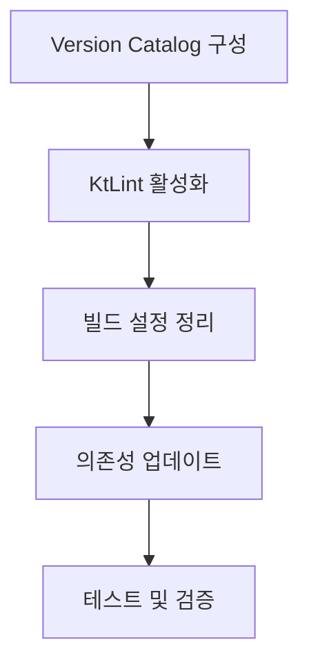

# Gradle 빌드 시스템 현대화 및 코드 품질 개선

## 📋 작업 개요

기존 프로젝트의 빌드 시스템을 현대화하고 코드 품질을 향상시키기 위한 Phase 1 작업입니다. 이 작업은 향후 확장성과 유지보수성을 크게 향상시킬 것입니다.

## 🎯 작업 목록

### 1. Gradle Version Catalog 도입
**우선순위**: High  
**예상 시간**: 45분

- [ ] `gradle/libs.versions.toml` 파일 생성
- [ ] 모든 의존성을 Version Catalog로 마이그레이션
- [ ] 중복 버전 정의 제거 및 일원화
- [ ] 플러그인 버전도 Catalog에 포함
- [ ] 모든 모듈에서 Catalog 사용 적용

**검증 기준**:
- 모든 의존성이 `libs.versions.toml`에서 관리
- 빌드 시 버전 충돌 없음
- 각 모듈에서 일관된 버전 사용
- Gradle 빌드 성공

### 2. KtLint 활성화 및 코드 스타일 표준화
**우선순위**: High  
**예상 시간**: 30분

- [ ] KtLint 플러그인 활성화
- [ ] Kotlin 코드 스타일 규칙 설정
- [ ] 기존 코드에 KtLint 적용
- [ ] IDE 설정 파일 추가 (.editorconfig)
- [ ] GitHub Actions에 코드 스타일 검사 추가

**검증 기준**:
- `./gradlew ktlintCheck` 성공
- 모든 Kotlin 파일이 스타일 규칙 준수
- CI/CD에서 자동 스타일 검사 동작
- IDE에서 일관된 포맷팅

### 3. 빌드 설정 정리 및 최적화
**우선순위**: Medium  
**예상 시간**: 25분

- [ ] 중복 플러그인 설정 제거
- [ ] 공통 빌드 로직을 `buildSrc` 또는 Convention Plugin으로 추출
- [ ] 불필요한 의존성 정리
- [ ] Gradle 캐시 최적화 설정
- [ ] 빌드 성능 프로파일링 및 개선

**검증 기준**:
- 빌드 시간 10% 이상 단축
- 중복 코드 제거됨
- 모든 모듈에서 일관된 빌드 설정
- 의존성 그래프 최적화

### 4. 의존성 업데이트 및 보안 점검
**우선순위**: Medium  
**예상 시간**: 20분

- [ ] 최신 버전으로 안전한 의존성 업데이트
- [ ] 보안 취약점 스캔 및 해결
- [ ] 호환성 검증 테스트 실행
- [ ] Dependency lock 파일 생성
- [ ] 자동 의존성 업데이트 설정

**검증 기준**:
- 모든 테스트 통과
- 보안 취약점 0개
- 호환성 이슈 없음
- 의존성 버전 고정됨

## 🔧 기술 세부사항

### Version Catalog 구조
```toml
[versions]
kotlin = "2.0.0"
keycloak = "26.3.1"
kafka = "3.8.0"
jackson = "2.18.0"
junit = "5.11.0"

[libraries]
keycloak-core = { module = "org.keycloak:keycloak-core", version.ref = "keycloak" }
kafka-clients = { module = "org.apache.kafka:kafka-clients", version.ref = "kafka" }
jackson-core = { module = "com.fasterxml.jackson.core:jackson-core", version.ref = "jackson" }

[plugins]
kotlin-jvm = { id = "org.jetbrains.kotlin.jvm", version.ref = "kotlin" }
ktlint = { id = "org.jlleitschuh.gradle.ktlint", version = "12.1.1" }
```

### KtLint 설정
```kotlin
ktlint {
    version.set("1.0.1")
    verbose.set(true)
    android.set(false)
    outputToConsole.set(true)
    coloredOutput.set(true)
    reporters {
        reporter(ReporterType.CHECKSTYLE)
        reporter(ReporterType.JSON)
    }
}
```

## 📈 예상 효과

### 개발 생산성 향상
- **의존성 관리**: 중앙집중식 버전 관리로 버전 충돌 방지
- **코드 품질**: 일관된 코드 스타일로 리뷰 효율성 증대
- **빌드 성능**: 최적화된 설정으로 빌드 시간 단축

### 유지보수성 개선
- **표준화**: 모든 모듈에서 일관된 설정
- **자동화**: 코드 스타일과 품질 검사 자동화
- **문서화**: 명확한 의존성 정의와 버전 관리

### 보안 강화
- **취약점 방지**: 최신 의존성으로 보안 패치 적용
- **의존성 고정**: Lock 파일로 재현 가능한 빌드
- **자동 검사**: CI/CD에서 보안 스캔 자동화

## 🔄 의존성 관계



## ✅ 완료 기준

### 기능적 요구사항
- [ ] 모든 빌드 태스크 성공
- [ ] KtLint 검사 통과
- [ ] 의존성 충돌 해결
- [ ] 테스트 100% 통과

### 비기능적 요구사항
- [ ] 빌드 시간 단축
- [ ] 코드 스타일 일관성
- [ ] 보안 취약점 0개
- [ ] 문서화 완료

## 🚀 다음 단계

이 작업 완료 후 다음 우선순위:
1. **Google OAuth2 Provider 구현**
2. **GitHub OAuth2 Provider 구현**
3. **Apple Sign-In Provider 구현**
4. **Korean UI 현지화 개선**

---

**소요 시간**: 약 2시간  
**난이도**: Medium  
**영향도**: High (전체 프로젝트 품질 향상)