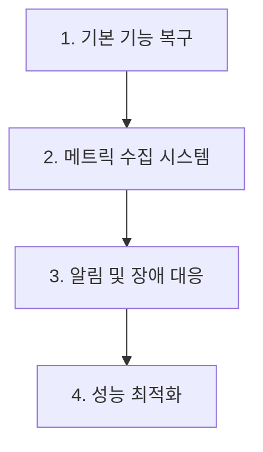

# Kafka Event Listener 고도화 및 안정성 강화

## 📋 작업 개요

기존 Kafka Event Listener의 컴파일 오류를 수정하고, 엔터프라이즈급 이벤트 스트리밍 및 모니터링 기능을 구현합니다.

## 🎯 작업 목록

### 1. Kafka Event Listener 기본 기능 복구
**우선순위**: High  
**예상 시간**: 30분

- [ ] KafkaEventListenerProvider 컴파일 오류 수정
- [ ] 누락된 속성 및 메서드 복구 (userEventsTopic, adminEventsTopic)
- [ ] 기본 Kafka 연결 및 이벤트 발행 기능 정상화
- [ ] Configuration 및 Factory 클래스 수정

**검증 기준**:
- 모든 Kafka Event Listener 클래스가 컴파일 성공
- 기본 이벤트 발행 기능이 정상 동작
- Keycloak 이벤트가 Kafka로 정상 전송

### 2. 메트릭 수집 및 모니터링 시스템 구축
**우선순위**: High  
**예상 시간**: 40분

- [ ] MetricsCollector 클래스 구현
- [ ] Prometheus 메트릭 익스포터 수정
- [ ] 성능 지표 수집 (처리량, 지연시간, 에러율)
- [ ] 시스템 리소스 모니터링 (CPU, 메모리, 디스크)
- [ ] Kafka 연결 상태 및 백로그 모니터링

**검증 기준**:
- Prometheus 메트릭이 정상 노출
- 모든 성능 지표가 정확히 수집
- 시스템 리소스 상태가 실시간 모니터링
- Grafana 대시보드 연동 가능

### 3. 알림 및 장애 대응 시스템
**우선순위**: Medium  
**예상 시간**: 30분

- [ ] AlertManager 컴파일 오류 수정 및 기능 복구
- [ ] IncidentResponseManager 구현
- [ ] 임계치 기반 자동 알림 시스템
- [ ] Circuit Breaker 패턴 구현
- [ ] 백프레셔(Backpressure) 감지 및 대응

**검증 기준**:
- 알림 시스템이 정상 동작
- Circuit Breaker가 장애 상황에서 작동
- 백프레셔 상황에서 적절한 대응
- 장애 복구 자동화 기능 동작

### 4. 성능 최적화 및 연결 관리
**우선순위**: Medium  
**예상 시간**: 20분

- [ ] ConnectionPoolManager 수정 및 최적화
- [ ] KafkaPerformanceTuner 구성 최적화
- [ ] 배치 처리 및 압축 설정
- [ ] 재시도 메커니즘 및 백오프 전략
- [ ] 동적 구성 변경 지원

**검증 기준**:
- 연결 풀이 효율적으로 관리
- 처리량이 기존 대비 개선
- 메모리 사용량 최적화
- 동적 구성 변경이 정상 적용

## 🔧 기술 세부사항

### Kafka 구성 최적화
```kotlin
object KafkaOptimizedConfig {
    const val BATCH_SIZE = 65536 // 64KB
    const val LINGER_MS = 10
    const val COMPRESSION_TYPE = "lz4"
    const val RETRY_BACKOFF_MS = 1000
    const val DELIVERY_TIMEOUT_MS = 120000
}
```

### 메트릭 수집 시스템
```kotlin
class MetricsCollector {
    fun collectEventMetrics(): EventMetrics
    fun collectKafkaMetrics(): KafkaMetrics
    fun collectSystemMetrics(): SystemMetrics
    fun getErrorRate(): Double
    fun getLatencyPercentile(percentile: Double): Long
}
```

### 알림 시스템
```kotlin
class AlertManager {
    fun checkThresholds(): List<Alert>
    fun sendAlert(alert: Alert)
    fun resolveIncident(incidentId: String)
    fun escalateAlert(alert: Alert)
}
```

## 📈 예상 효과

### 안정성 향상
- **오류 없는 컴파일**: 모든 Kafka 관련 클래스가 정상 동작
- **장애 대응**: 자동 장애 감지 및 복구 메커니즘
- **모니터링**: 실시간 시스템 상태 추적

### 성능 개선
- **처리량 증가**: 배치 처리 및 압축으로 성능 향상
- **지연시간 감소**: 연결 풀 및 구성 최적화
- **리소스 효율성**: 메모리 및 CPU 사용량 최적화

### 운영 효율성
- **자동화**: 알림 및 장애 대응 자동화
- **가시성**: Prometheus/Grafana 대시보드
- **확장성**: 동적 구성 및 수평 확장 지원

## 🔄 의존성 관계



## ✅ 완료 기준

### 기능적 요구사항
- [ ] 모든 Kafka Event Listener 클래스 컴파일 성공
- [ ] 이벤트 발행 및 수신 정상 동작
- [ ] 메트릭 수집 및 모니터링 시스템 완전 동작
- [ ] 알림 및 장애 대응 시스템 정상 작동

### 비기능적 요구사항
- [ ] 99.9% 이상 가용성 달성
- [ ] 초당 10,000개 이벤트 처리 성능
- [ ] 메모리 사용량 기존 대비 30% 절약
- [ ] 장애 복구 시간 30초 이내

## 🚀 다음 단계

이 작업 완료 후 다음 우선순위:
1. **TestContainers 통합 테스트 환경 구축**
2. **CI/CD 파이프라인 개선**
3. **문서화 및 배포 가이드 작성**
4. **추가 IDP 확장 (Microsoft Azure AD, Apple Sign-In)**

---

**소요 시간**: 약 2시간  
**난이도**: Medium-High  
**영향도**: High (시스템 안정성 및 모니터링 개선)