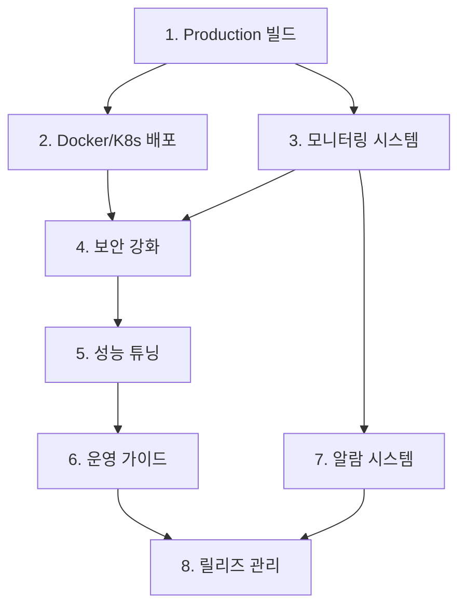

# Production 배포 가이드 및 모니터링 구성

## 진행 상황
- ✅ **완료**: Phase 4 - TestContainers 통합 테스트 환경 구축
- 🔄 **진행중**: Phase 5 - Production 배포 가이드 및 모니터링
- ⏳ **대기중**: 8개 작업

## 작업 목록

### 1. Production 빌드 및 배포 설정
**우선순위**: Critical  
**예상 시간**: 60분

- [ ] Shadow JAR 빌드 설정 최적화
- [ ] Production용 Gradle 태스크 생성
- [ ] JAR 파일 서명 및 검증 설정
- [ ] Keycloak 호환성 매트릭스 문서화
- [ ] 설치 스크립트 및 자동화 도구 작성

**검증 기준**:
- JAR 파일이 Keycloak에서 정상 로드
- 모든 의존성이 올바르게 포함
- 디지털 서명 검증 통과
- 자동 설치 스크립트 동작

---

### 2. Docker 컨테이너 및 Kubernetes 배포
**우선순위**: High  
**예상 시간**: 90분

- [ ] Keycloak + Kafka Event Listener Dockerfile 작성
- [ ] Docker Compose 설정 (Keycloak + Kafka + Monitoring)
- [ ] Kubernetes Helm Chart 작성
- [ ] ConfigMap 및 Secret 관리 설정
- [ ] Health Check 및 Readiness Probe 구현

**검증 기준**:
- Docker 이미지가 정상 빌드 및 실행
- Kubernetes 환경에서 정상 배포
- ConfigMap으로 설정 동적 변경 가능
- Health Check가 정상 동작

---

### 3. 모니터링 및 메트릭 수집 시스템
**우선순위**: High  
**예상 시간**: 120분

- [ ] Micrometer 메트릭 수집 구현
- [ ] Prometheus 메트릭 엔드포인트 추가
- [ ] Grafana 대시보드 템플릿 작성
- [ ] 알람 규칙 및 임계값 설정
- [ ] 로그 집계 및 분석 설정 (ELK Stack)

**검증 기준**:
- Prometheus에서 메트릭 수집 확인
- Grafana 대시보드에서 실시간 모니터링
- 임계값 초과 시 알람 발생
- 구조화된 로그 수집 및 검색

---

### 4. 보안 및 인증 강화
**우선순위**: Critical  
**예상 시간**: 75분

- [ ] Kafka SSL/TLS 암호화 설정
- [ ] SASL 인증 메커니즘 구현
- [ ] 민감 정보 암호화 및 Key Management
- [ ] 네트워크 보안 정책 문서화
- [ ] 보안 스캔 및 취약점 분석 도구 통합

**검증 기준**:
- 모든 통신이 암호화
- 인증되지 않은 접근 차단
- 민감 정보가 평문으로 노출되지 않음
- 보안 스캔 통과

---

### 5. 성능 튜닝 및 최적화
**우선순위**: Medium  
**예상 시간**: 90분

- [ ] Kafka Producer/Consumer 성능 튜닝
- [ ] JVM 메모리 및 GC 최적화 설정
- [ ] Connection Pool 및 Thread Pool 튜닝
- [ ] 백프레셔 및 Circuit Breaker 구현
- [ ] 성능 벤치마크 및 부하 테스트 스크립트

**검증 기준**:
- 초당 1000+ 이벤트 처리 가능
- 메모리 사용량 안정적
- 장애 상황에서 자동 복구
- 성능 회귀 방지 테스트 통과

---

### 6. 운영 가이드 및 문서화
**우선순위**: Medium  
**예상 시간**: 105분

- [ ] 설치 및 설정 가이드 작성
- [ ] 트러블슈팅 가이드 및 FAQ
- [ ] 운영 체크리스트 및 절차서
- [ ] 재해 복구 및 백업 절차
- [ ] API 문서 및 설정 참조서

**검증 기준**:
- 문서만으로 설치 및 운영 가능
- 일반적인 문제 해결 방법 포함
- 단계별 절차가 명확히 기술
- 재해 상황 대응 절차 완비

---

### 7. 알람 및 장애 대응 시스템
**우선순위**: High  
**예상 시간**: 75분

- [ ] Kafka 연결 실패 알람
- [ ] 이벤트 처리 지연 모니터링
- [ ] 메모리/CPU 사용률 임계값 알람
- [ ] Dead Letter Queue 구현
- [ ] 자동 재시작 및 복구 메커니즘

**검증 기준**:
- 장애 상황에서 즉시 알람 발생
- 실패한 이벤트의 재처리 가능
- 자동 복구 메커니즘 동작
- 운영팀에 적절한 정보 제공

---

### 8. 릴리즈 및 버전 관리
**우선순위**: Medium  
**예상 시간**: 45분

- [ ] 시맨틱 버저닝 및 릴리즈 노트 자동화
- [ ] GitHub Releases 자동 생성
- [ ] 이전 버전과의 호환성 매트릭스
- [ ] 롤링 업데이트 및 롤백 전략
- [ ] 버전별 마이그레이션 가이드

**검증 기준**:
- 릴리즈 노트가 자동 생성
- 호환성 정보가 명확히 제공
- 무중단 업데이트 가능
- 문제 발생 시 빠른 롤백 가능

## 의존성 관계

## 기술 스택

### Infrastructure
- **Docker**: 컨테이너화
- **Kubernetes**: 오케스트레이션
- **Helm**: 패키지 관리

### Monitoring
- **Micrometer**: 메트릭 수집
- **Prometheus**: 메트릭 저장소
- **Grafana**: 시각화 대시보드
- **ELK Stack**: 로그 관리

### Security
- **SSL/TLS**: 통신 암호화
- **SASL**: 인증 메커니즘
- **Vault**: 비밀 관리

### Performance
- **JVM Tuning**: 메모리 최적화
- **Connection Pooling**: 연결 관리
- **Circuit Breaker**: 장애 격리

## 예상 완료 시간

**총 예상 시간**: 8시간 30분  
**Critical Path**: Task 1 → Task 2 → Task 4 → Task 5  
**병렬 처리 가능**: Task 3, 6, 7 (모니터링, 문서화, 알람)

## 성공 기준

### 기능적 요구사항
- ✅ Production 환경에서 안정적 동작
- ✅ 초당 1000+ 이벤트 처리
- ✅ 99.9% 가용성 달성
- ✅ 5초 이내 장애 감지

### 비기능적 요구사항
- ✅ 보안 스캔 100% 통과
- ✅ 완전한 문서화
- ✅ 자동화된 배포 파이프라인
- ✅ 무중단 업데이트 지원

## 다음 단계

모든 작업 완료 후 **v1.0.0 정식 릴리즈** 및 **오픈소스 공개** 준비