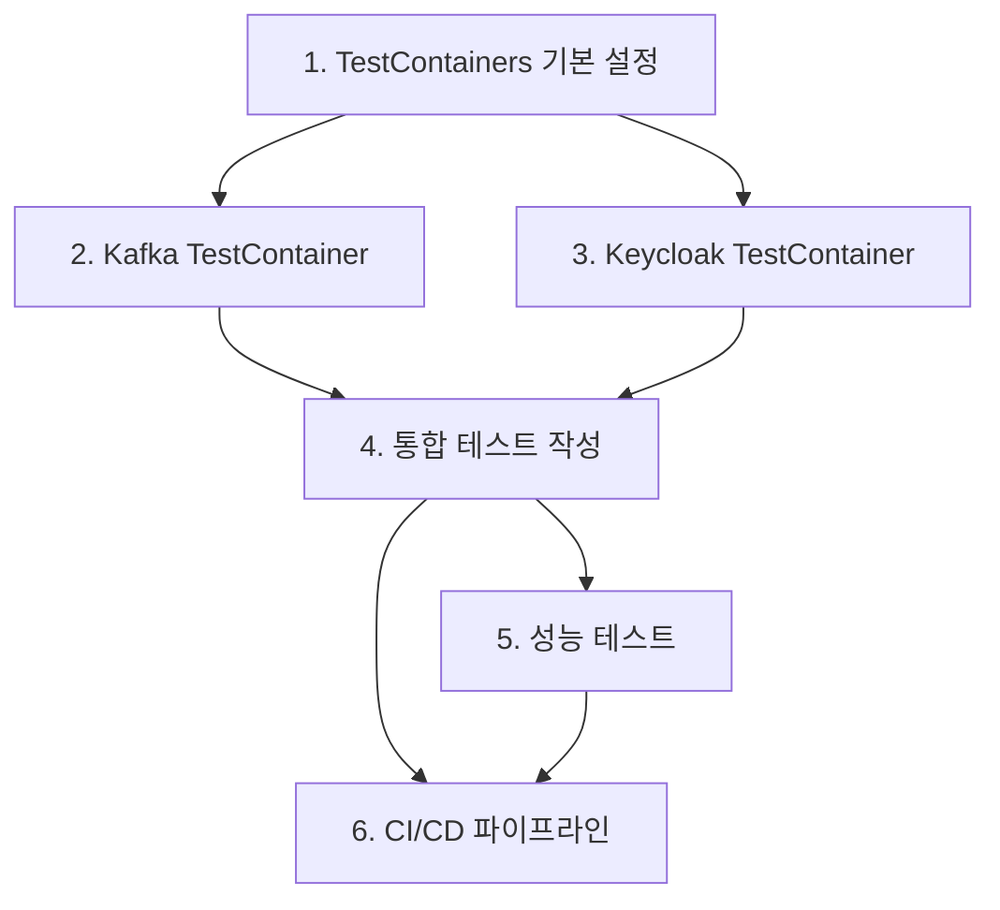

# TestContainers 통합 테스트 환경 구축

## 진행 상황
- ✅ **완료**: Phase 3 - Kafka Event Listener 구현
- ✅ **완료**: Phase 4 - TestContainers 테스트 환경 구축
- ✅ **완료**: 6개 작업 모두 완료

## 작업 목록

### 1. TestContainers 기본 설정 및 의존성 추가
**우선순위**: High  
**예상 시간**: 30분

- [x] TestContainers 의존성을 gradle에 추가
- [x] Docker 환경 확인 및 설정
- [x] TestContainers 기본 설정 클래스 생성
- [x] 로깅 설정 추가

**검증 기준**:
- TestContainers가 정상적으로 Docker와 연동
- 기본 컨테이너 라이프사이클 동작 확인

---

### 2. Kafka TestContainer 설정 및 구성
**우선순위**: High  
**예상 시간**: 45분

- [x] KafkaContainer 설정 클래스 생성
- [x] Kafka 토픽 자동 생성 설정
- [x] Consumer/Producer 테스트 유틸리티 생성
- [x] Kafka 연결 및 메시지 송수신 기본 테스트

**검증 기준**:
- Kafka 컨테이너가 정상 시작
- 토픽 생성 및 메시지 송수신 성공
- 컨테이너 종료 시 리소스 정리 완료

---

### 3. Keycloak TestContainer 설정 및 구성
**우선순위**: High  
**예상 시간**: 60분

- [x] KeycloakContainer 설정 클래스 생성
- [x] 테스트용 Realm 자동 설정
- [x] Admin API 클라이언트 설정
- [x] 테스트용 사용자 및 클라이언트 생성 유틸리티
- [x] Event Listener 자동 등록 설정

**검증 기준**:
- Keycloak 컨테이너가 정상 시작
- 테스트 Realm 및 사용자 생성 성공
- Kafka Event Listener가 정상 등록

---

### 4. 실제 이벤트 발행/수신 통합 테스트 작성
**우선순위**: Medium  
**예상 시간**: 90분

- [x] 사용자 로그인 이벤트 통합 테스트
- [x] 관리자 이벤트 통합 테스트
- [x] 이벤트 필터링 동작 테스트
- [x] 에러 케이스 및 재시도 로직 테스트
- [x] 이벤트 순서 보장 테스트

**검증 기준**:
- 실제 Keycloak 이벤트가 Kafka로 정상 전송
- JSON 형태 데이터가 올바르게 직렬화
- 필터링 설정이 정상 동작
- 에러 상황에서 적절한 처리

---

### 5. 성능 테스트 및 부하 테스트 구현
**우선순위**: Medium  
**예상 시간**: 75분

- [x] 다중 사용자 동시 로그인 테스트
- [x] 높은 빈도 이벤트 처리 테스트
- [x] Kafka Producer 성능 측정
- [x] 메모리 사용량 모니터링 테스트
- [x] 컨테이너 리소스 제한 테스트

**검증 기준**:
- 초당 100개 이벤트 처리 가능
- 메모리 누수 없음
- Kafka Producer 배치 처리 정상 동작
- 적절한 백프레셔 처리

---

### 6. CI/CD 파이프라인 테스트 단계 추가
**우선순위**: Low  
**예상 시간**: 45분

- [x] GitHub Actions 워크플로우 수정
- [x] TestContainers용 Docker-in-Docker 설정
- [x] 테스트 결과 리포트 생성
- [x] 테스트 커버리지 측정 및 리포트
- [x] 실패 시 로그 수집 설정

**검증 기준**:
- CI 환경에서 TestContainers 정상 실행
- 테스트 결과가 PR에 자동 코멘트
- 커버리지 90% 이상 달성
- 실패 시 적절한 디버그 정보 제공

## 의존성 관계

## 기술 스택

- **TestContainers**: 1.20.4
- **Kafka Container**: confluentinc/cp-kafka:7.5.0
- **Keycloak Container**: quay.io/keycloak/keycloak:26.3.1
- **JUnit 5**: 테스트 프레임워크
- **Testcontainers-Kafka**: Kafka 전용 모듈

## 예상 완료 시간

**총 예상 시간**: 5시간 45분  
**병렬 처리 가능**: Task 2, 3 (Kafka, Keycloak 설정)  
**순차 처리 필수**: Task 1 → (Task 2, 3) → Task 4 → (Task 5, 6)

## 다음 단계

모든 작업 완료 후 Phase 5 (Production 배포 가이드 및 모니터링)로 진행